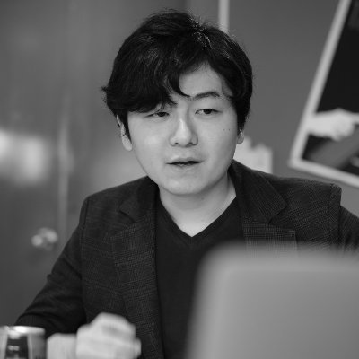
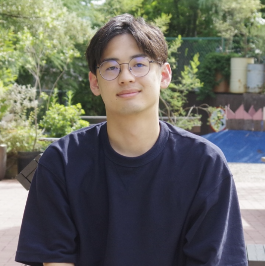
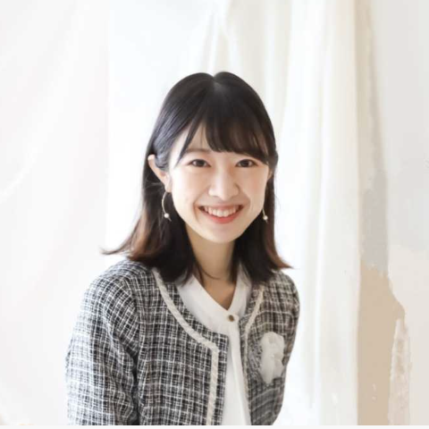
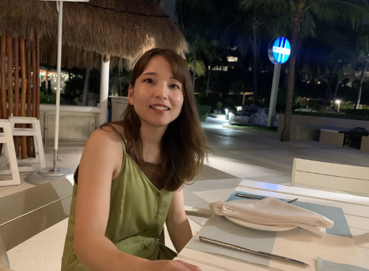
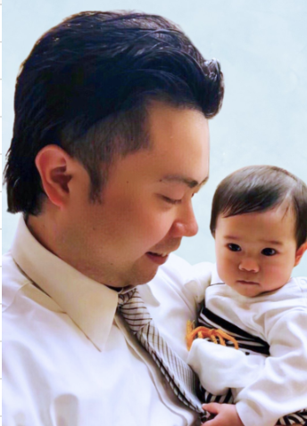
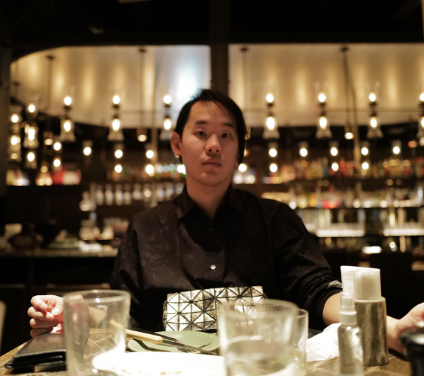
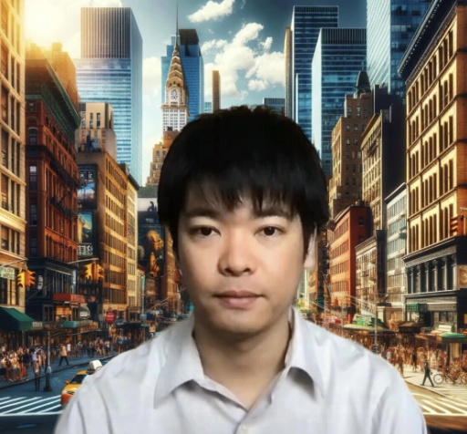

## 生成AI塾 第4期生募集のお知らせ🎉
https://github.com/dai-motoki/genaiacademy4/blob/main/schedule.md

### プログラム特色:

#### 卒業生の実績が物語る、生成AI塾の実力

- デジタル庁、NTTの案件を受講後に受注。生成AIの力を政府や大手企業で発揮
- エンジニア未経験から3ヶ月でDifyを主要3クラウドに搭載。クラウド環境で生成AIを駆使
- エンジニア未経験から1ヶ月でIoTデバイス開発。短期間で実践的なスキルを習得
- エンジニア未経験から3ヶ月で生成AIを駆使したゲーム開発実装。

#### 代表の元木大介と強力な講師陣が徹底サポート

- 代表元木大介: 東大大学院理学系研究科物理学専攻修了後、量子ベンチャーなどで働いたのち株式会社KandaQuantumを創業。合計5500名を超える国内最大規模の生成AIコミュニティを運営。東京AI祭や各種GPTsにおける生成AIハッカソンで審査員を行う。ネスレ日本、コニカミノルタ、九州大学大学院医学院等多くの企業と生成AIの共同研究開発をリード、1.2万人IVS京都生成AIピッチ受賞。日本語で記述できるビジネス・開発全てに利用可能な自然言語プログラミング開発者 Zoltraak、Niwatoko、生成AIの第一人者が直接指導

## 講師陣

### 藤田拳 / FUJITA Ken

#### 専門分野
マーケティング・フロントエンドエンジニア

#### 経歴
東京大学大学院を卒業後、AGC株式会社に入社。機械学習を活用した信号制御に関連するデバイスの開発からマーケティングまでを広く担当。現職ではデジタルマーケティング領域におけるコンサルタントとして、戦略企画、サイト改善・運用ディレクションなどを行う。事業会社におけるAI活用を積極的に推進しており、実例をベースにした講義が得意。

#### SNS
https://twitter.com/kenfjt

### 幸川莉子

#### 専門分野
Create.xyz,ChatGPT（ともに初心者向け）

#### 経歴
地方テレビ局アナウンサー→エンジニア→生成AI講師・アナウンサー

#### 実績
Create.xyz公式アンバサダー,Voicy ITビジネスニュースパーソナリティ,AI関連イベント司会,生成AI企業研修講師

#### SNS
幸川莉子 (@riko_sachikawa) / X

### あやみ

#### 専門分野
マーケティング

#### 経歴
新卒でネット専業の広告代理店に入社し、web広告運用に従事。その後、ECコンサルティング事業を展開するスタートアップに入社し、ECマーケティング・M&Aなどを担当。現在はスタートアップでSaaS事業のBtoBマーケティングを担当。

#### 実績
NewsPicks トピックスで記事執筆。ChatGPT研究所の運営。AI活用セミナーの講師などを担当。

#### SNS
https://x.com/ayami_marketing

### 篠田 敬廣 (シノダ ユキヒロ)

#### 専門分野
- 3大クラウドの基礎
- 生成AIのキャリア

#### 経歴
大手SIerにてインフラの構築/設計/プロジェクトマネジャーを従事の後退職し独立。生成AI案件のフリーランス→会社設立。

#### 実績
- FlowGPT ハッカソンで2位入賞および傑出賞受賞
- 大手企業のプロンプトエンジニアリング、生成AIのPoCにて環境構築やLLMの検証/評価

#### SNS
- LinkedIn: [Shinoda Yukihiro](https://www.linkedin.com/in/yukihiro-shinoda/) 
- X: [yukkie1114](https://x.com/yukkie1114)
- note: [shinoda](https://note.com/yukkie1114)

### 坂本直樹

#### 専門分野
事業開発とテクノロジー

#### 経歴
事業開発とテクノロジーを得意としており、これまでにCTOとしてスタートアップを3社起業し、その後7社を支援しました。現在は主に生成AIアプリの開発に従事しています。

#### 実績
生成AIに関する受託、顧問、コンサルなど多数

#### SNS
https://x.com/jar2

### ビヨンド

#### 専門分野
戦略コンサル・新規事業立案等

#### 経歴
新日鐵→BCG→独立

#### 実績
AI活用したデータベースSaaSやAI活用したリサーチ代行

#### SNS
https://x.com/tamazo6381

### あきらパパ（本名：舟越 彬/Funakoshi Akira）

#### 専門分野
生成AI関連API活用、ChatGPT活用、システム開発、プログラミング教育
担当講座：あきらパパの現役エンジニア流ChatGPT活用講座

#### 経歴
- フリーランスエンジニア（主にシステム開発・プログラミング教育）
- エンジニア歴：10年目
- IT企業研修：10社以上でエンジニア向け研修を担当

#### 実績
- 生成AIツールの活用（ChatGPT, Claude, Cursor, Dify, イルシルなど）
- 好きな生成AIツール：Cursor, Create, Github Copilot, AutoGen, Open Interpreter,

#### SNS
X（旧Twitter）アカウント：あきらパパ【生成AI活用エンジニア&３児のパパ】（@akira_papa_IT）
https://x.com/akira_papa_IT

### なつ / 永松健志

#### 専門分野
UXリサーチ&デザイン

#### 経歴
大学・大学院でサービスデザイン/デザイン思考/UXに触れ、以来10年以上デザイン界隈に。 現在は銀座のWeb制作会社ニジボックスでUXリサーチャー/ディレクターをやりつつ、UX人材教育や品質管理、AI活用研究・推進などにも携わっている。

#### SNS
・https://x.com/Dia_Nexus
・https://note.com/art_reflection

### まる

#### 専門分野
Dify講座

#### 経歴
IT企業にて企画業務に従事

#### 実績
Dify関連のnoteを執筆

#### SNS
https://twitter.com/RunRfa

### gimu

#### 専門分野
自然言語プログラミング初級編

#### 経歴
生成AIを活用したプログラミング・ゲーム開発。人材会社でwebマーケティングも行う。

#### 実績
・AI botノベルゲーム(create.xyz)
https://visual-novel-game-scene.created.app/novel-game
・パズル(Claude3.5)
https://claude.site/artifacts/12f83fee-ff6b-4fc6-9ccd-c9ce69a65130

#### SNS
@gimu_ai
https://x.com/gimu_ai

## 魅力的な環境
- 柔軟なスケジュール: 忙しい方々も参加しやすいよう、週末を中心にプログラムが組まれています。あなたのペースで学べる
- ネットワーキング: 同じ目標を持つ仲間と出会い、志高き仲間と切磋琢磨し刺激し合うことができます。

### 開催開始:
- 2024年8月10日(土)

### 開催場所  
- オンライン、オフラインOK（場合によって人数を調整いたします）
- オフラインは東京都内麹町（詳細は購入手続き後連絡いたします）

### 上限人数
オフライン10名上限、オンライン上限は要検討

### 1講座時間
1回 2.5時間

## 受講内容詳細・金額

以下URLをご覧ください 

https://genai-academy4.vercel.app/

